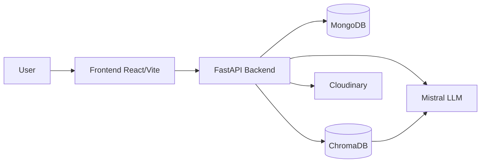

# Knowledge Enterprise Automation

A secure multi-tenant enterprise knowledge assistant built with a FastAPI backend, a React/Vite frontend, MongoDB, ChromaDB, Cloudinary, and Mistral-powered RAG.

## Overview

The project lets admins upload company documents, manage access, and provide employees with policy-aware chat answers grounded in approved documents.

## Repository Structure

- `backend/` - FastAPI app, controllers, schemas, database setup, and RAG services
- `frontend/` - React/Vite UI for landing pages, authentication, dashboards, and chat
- `chroma_db/` - Local Chroma vector store data
- `requirements.txt` - Python dependencies for the backend

## Features

- OTP-based signup and login
- Role-based access for admins and employees
- Secure document upload and storage
- Tenant-scoped retrieval with ChromaDB
- Grounded chat responses using Mistral
- Responsive React frontend

## Prerequisites

- Python 3.12+ recommended
- Node.js 18+ recommended
- MongoDB running locally or remotely
- ChromaDB storage available in the workspace
- Optional Cloudinary and Mistral credentials for full functionality

## Backend Setup

1. Open a terminal in `backend/`.
2. Activate the virtual environment on Windows:

```powershell
.\myvenv\Scripts\Activate.ps1
```

3. Install dependencies if needed:

```powershell
pip install -r ..\requirements.txt
```

4. Create or update `backend/.env` with values such as:

```env
MONGO_URI=your_mongodb_connection_string
JWT_SECRET_KEY=your_secret_key
MISTRAL_API_KEY=your_mistral_api_key
CLOUDINARY_CLOUD_NAME=your_cloud_name
CLOUDINARY_API_KEY=your_cloudinary_key
CLOUDINARY_API_SECRET=your_cloudinary_secret
SMTP_USERNAME=your_email
SMTP_PASSWORD=your_email_password
SENDER_EMAIL=your_sender_email
```

5. Run the backend:

```powershell
uvicorn main:app --reload
```

The API starts on `http://127.0.0.1:8000` by default.

## Frontend Setup

1. Open a terminal in `frontend/`.
2. Install dependencies:

```powershell
npm install
```

3. Create or update `frontend/.env` if you want to override the API base URL:

```env
VITE_API_BASE_URL=http://127.0.0.1:8000
```

4. Start the frontend:

```powershell
npm run dev
```

The app starts on `http://127.0.0.1:5173` by default.

## Common Pages

- Landing page: marketing overview and navigation
- Login and signup: authentication flow
- Dashboard: role-specific admin or employee actions
- Chat: ask questions against approved company documents

## API Summary

### Backend

- `GET /` - Health check
- `POST /auth/send-otp` - Send OTP for signup
- `POST /auth/signup` - Complete signup after OTP verification
- `POST /auth/login` - Login and receive JWT token
- `GET /users/` - List users
- `POST /users/{user_id}/profile-image` - Upload a user profile image
- `GET /documents/` - List documents
- `GET /chats/` - List accessible chats
- `POST /chats/{chat_id}/ask` - Ask a question against a chat document

## Architecture Flow



## Notes

- The backend contains separate route modules for auth, users, documents, and chats.
- The frontend uses `AuthContext` for auth state and `react-markdown` for rendering formatted chat responses.
- The vector store is persisted in `chroma_db/`.

## Troubleshooting

- If login or signup fails, confirm MongoDB is reachable and `.env` values are set correctly.
- If chat responses are not grounded, confirm the document was indexed successfully in ChromaDB.
- If the backend cannot start, ensure the active virtual environment has the required packages installed.
